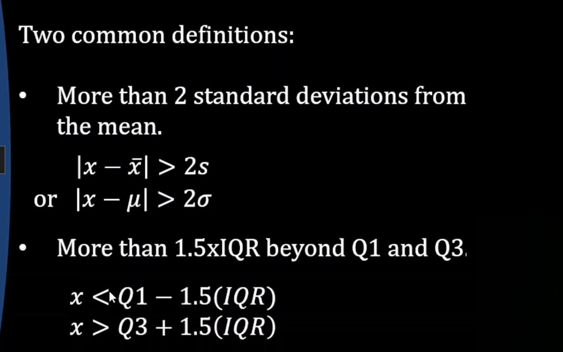

# Cleaning Data
## 1. Outlier

**An outlier** is an extremely high or extremely low data point relative to the nearest data point and the rest of the neighboring co-existing values in a data graph or dataset you're working with.

**How to find outliers?**

