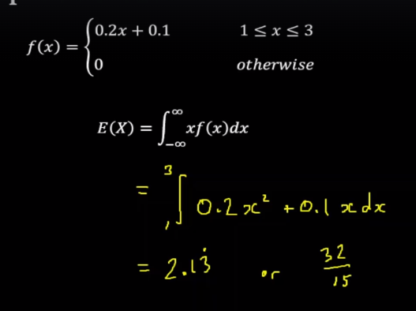

# Continuous Distributions

## 1. What is Continuous Distributions?

**Continuous data** is a type of numerical data that refers to the unspecified number of possible measurements between two realistic points.

## 2. Normal Distributions

### 2.1. Definition

**Normal distribution,** also known as the **Gaussian distribution**, is a probability distribution that is symmetric about the mean, showing that data near the mean are more frequent in occurrence than data far from the mean.

In graphical form, the normal distribution appears as a `bell curve`.

### 2.2. The Empirical Rule

:max_bytes(150000):strip_icc():format(webp)/dotdash_final_Optimize_Your_Portfolio_Using_Normal_Distribution_23-0701d4f1047045a392ba624b68a8b8be.jpg)

### 2.3. Formula

### 2.4. Calculate in Excel

***Calculate Normal Distribution:***

`NORMDIST(x, mean, standard_dev, cumulative)`

- ***x***: Represents the value for which you want to calculate the normal distribution.
- ***mean***: Denotes the mean or average value of the distribution.
- ***standard_dev***: Indicates the standard deviation of the distribution.
- ***cumulative***: A logical value that determines the type of distribution. If set to TRUE (or omitted), it returns the cumulative distribution function. If set to FALSE, it returns the probability density function.

***Calculate inverse of Normal Distribution***

`= NORMINV (probability, mean, standard deviation)`

### 2.5. Z-score

The **standard normal distribution**, also called the **z-distribution**, is a special normal distribution where the mean is 0 and the standard deviation is 1.

**Z-score**

## 3. Normal Approximations to Binomial Distributions

***Example***

## 4. Normal Approximations to Poisson Distributions

***Example***

## 5. The Central Limit Theorem

The **central limit theorem** states that if you take sufficiently large samples from a population, the samples’ means will be normally distributed, even if the population isn’t normally distributed.

***Example***

## 6. Continuous Random Variables

***Example***

**Expectation and Variance**

***Example***

**Median**

**Quatiles**

**Mode**

