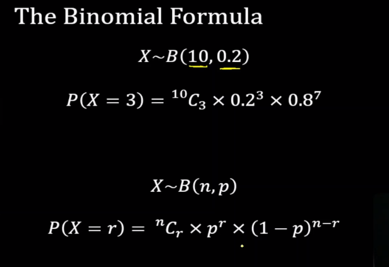

# Discrete Distributions
## 1. What is Discrete Distributions?
### 1.1. Discrete Data
**Discrete data** refers to countable, individualized, and nondivisible figures in statistics. These data points exist only in set increments. 

**Discrete data** represents discrete variables, which you can count in a finite amount of time. The key feature here is that these variables are countable instead of measurable.

### 1.2. Continuous Data
**Continuous data** is a type of numerical data that refers to the unspecified number of possible measurements between two realistic points.

### 1.3. Discrete Data vs Continuous Data

### 1.4. Discrete Distribution

A **discrete distribution** is a probability distribution that depicts the occurrence of discrete (individually countable) outcomes, such as 1, 2, 3, yes, no, true, or false

:max_bytes(150000):strip_icc()/binomial-distribution-58bda7e33df78c353c7912de.jpg)

## 2. The Expectation and Variance of a Discrete Random Variable

### 2.1. Expectation
The **expected value** of random variable X is often written as E(X) or µ or µX.

For a discrete random variable **the expected value** is calculated by summing the product of the value of the random variable and its associated probability, taken over all of the values of the random variable.

### 2.2. Variance

***Note***

## 3. Binominal Distribution
### 3.1. Definition
**Binomial distribution** is a statistical distribution that summarizes the probability that a value will take one of two independent values under a given set of parameters or assumptions.

### 3.2. Formula

## 4. Poisson Distribution

### 4.1. Definition
In statistics, a **Poisson distribution** is a probability distribution that is used to show how many times an event is likely to occur over a specified period.

**Poisson distributions** are often used to understand independent events that occur at a constant rate within a given interval of time. 

### 4.2. Formula
:max_bytes(150000):strip_icc():format(webp)/poisson-56a8fa9e3df78cf772a26eb0.jpg)

***Example***

## 5. Geometric Distribution

### 5.1. Definition

The **geometric distribution** represents the number of failures before you get a success in a series of Bernoulli trials.

A **geometric distribution** can have an indefinite number of trials until the first success is obtained

### 5.2. Formula

![Alt text](data:image/png;base64,iVBORw0KGgoAAAANSUhEUgAAAYMAAACCCAMAAACTkVQxAAABO1BMVEX///8AAADfigD99ubloj3qtFn02KjfiADwzJIhz//8/Pz39/fy8vLS0tIAzf/w8PCysrLp6enFxcX/8+unp6eBgYHc3NwnJydUVFTj4+Pq6upPT0+Xl5eJiYnX19etra1gYGD/sQBpaWm6urqcnJz/qwA+Pj4vLy+/v7/X6PcRERFFRUUiIiIAdNL/aQCPj4//w6j/1cF2dnb/fz2s7P9Z2f/N8/8AfdXjlwAAas//nm//lF3p8/uax+w9j9nh+P+Y5v//x2z/15HA8P//w1b/57p54P/z1afknzH56dD67tT/592/2/NDl9z/0Lr/onv/up+PuudsreP/ikz/chvM4fT/so/uwoH/uyz/3p//0Yb/uSL/wkH/9Nv/0Hb/xmFRx9rwzZmrzu5bo+B4seT/ezIKhdf/7OP127gXefleAAAPfElEQVR4nO2dC0PbthbHJehTtuNHns4bJyQhCU1ICVAIj5XS0hKglMJdu269C5Tu+3+Ce46UJ3FCtq7XQPTf6tiSLcv6SedIxrIJkZKSkpK682LbyzvbXmdiurVc9/l8T5nX2ZhiLT/1PQX5VrzOyNRqu84JAIO/f+ysS1hI40pOlEA0NCJC0TR91EEMTmFPlPxEMjG7oZuNgDkqrz+s7adghTiF+t870A//z+0Nh+doEURzEyUSyLlfu16iNDzimi04A6VBddKMArSBrUR2MLaCGaYlDVZDjj3qoACpxEYlnKn9mBkHT/B6e6UOzWDZ/ewj9OhXYDDvxiCu6KDJiigQcz9ZLWfqkYhrlEVrSd20aGTi61YcrX8zf+3IeEzR1VCNWlCYtLunHelvh0o+TeLpUQkHqTJpXty0A00AOkS78NMO2X5df73SwF7SDjiIndevYfnp3adfXpJPv3yG+L3Pn/f+mH33Zf7l7/75Ty9/eXQtxdy1ajZWIxiwXAZKwXKLUmiC/5o0NelJlLBrSh1VBOsgxV27oTYdsIWQTRcGnYR/CMEKWiHOwLcjQsA2wX8rvtcE/4Gv8Pl2yfz83Nz8F/gHIHB1fu/rPGz4MXzu3WCSPQbRjIF5ZCm9YJiEGLaVChEtVYCgDGyTQlIwSBoG9x5JIyNajxkIBw0DD7YMvqedUYyMoJWl7dTjBVxaqUy0fS6skywD59IhlFdQ28BAO1BOGAaEWKEkpqlZ/FxGx9S1GSjUIHoGSlMzYFmI0wAcBEklQ3hQJgQMmGUUIBdKCrNphcxOwkmL55HnQDFULZWZDMoulHR9mfvi+gr2jNrhdbBJ2yttBru++jbsQ+ZeETL3GyO/fSFzXwj5A2zQy3m0RZ/J2+v2KBdorxi0XKKlKFFpLlcum4TmIhEaLzm0RtQi5joX5wyy1ElTOChBc3kqYKSLsZrjxJUYLZWxvqdortQ2PrVa37n0fN6JoBFJ0XyORhSihnPpXKkWc/CoLE075TTR0sUIpGaQdDicgxMFI+gD8nmaHWBAnArRoPLXaClM9UqaOnCQTZwyHBQnxQDYrBxcUD5KdApeg5UCyU7CmEIWrpI6jERpJFejsUkgLIvuaLtHBL+djilvFqTNYAebgc9H5v8ABl8JefXld2gKZK/LYI/8PvdyMOVSOAaK2DbNqszMO2g9FDMcINSByHIUyguKChmUsshApxk0xICqQFgwzdNgOV7Ja2WbqQEaApwpKB9et9OJvnPFgsDFyCshGlCUUB7gwvlUConU0uA4bKSUISwvTIZDTVahJIFRBUUxqDnAIOEQrajqcBrFqYEtEm2yRkMM2l44BaUchwvK4QmQQSTQTTiOKRqKkiwHiV6OqSRJBzzQOAR92u3ECBorvjoyWPbVl5fBLfQYzM7B6qOxDNLZeDyeVcWladRUoBCxX4Fl7QQxaICBEoyahQqURy4WsHRRLAr6A6hv/BIjCWIUISzNjYfjYHzQqdUSCqNYD9NUD/Iui0WZGgZ4RWw5MVIrQmStjGBEUSE+LYYMag7fXx1g4CSAgU5oOqWZURKiUREK7c7OcQZlxi8o2mWg9hikeYpQlXSK1ad8s7NaGUTge9obnu346juv6ytPn+7UfTsN39OdnfpyHwPyau7zpznOAH0yMJi/xqBji9IVwsvRVqjo8GHmnMQQA8g4jSSAgVoJU2j1PQamKIZshDNoK0DRIldqwVJYtamBynQaBw1xL1k00NkTJ53BSK3HQCQODGL9RdTnD5BBNFimYLG6DIL8BxgIn6xT041BiRs2iNG5OZ2AAVqfeg9Bvb9z8hqMTx1Q+DB4G03RCsG6/itw+PqKsC/z81/n3kL9n99DBrNz1zpGHZ8c5yMEC9vBMIOyhf09ZAAXC/U7SaMZvNiC2LfTDrhFKlX6Gai07RDyeZU3LWgooURenEvAbTOohDEwFRSBqVofg2AJV4KVfgbYLwJbFMBAg4J5g34R2PoeA9EbsDrtIB9oJ+wgA4cnksJ2MCGDen23ry3sDEZu76JHaOyKtrEydAdjdnzHvMPApEFb12iQuDAgsTRAopyBBplWIzQKNj2qpoSNFgzAS1u6nYDD+xhAIThaNGqVS8AgWNQIS1DdpglTt2iwnwGzaUWB1CE76Yhu5vsZJGncjKZouxbD+EAPObgFDDSa0dUsZSa4mAKY9X4GNXFBKrbWLHYj2gnHMcVKNJqhlckZ8KL8b4fBv3vDNN/pm2p5GM/WFOHCQFhp08IfEKtYzjvFOI6TmQN9lBqUvVGE/UXelbCBPywIIXmN16+eLBhDU5q1sKLWivkyGgQLzBiUjuhwYSI4ALfC5XwRizCUp7Rkkpio99gvyoC9KXb6RWKcjECwXxSAGKwuKfiBg9Oi2VEcJzuwX1pBexjOp/E62wlX2ikCAugXJcXuE2hvbq4NoTMy+JcUinbW1KSGbpRpoqOGN4BswKFin8HUkixkivtFSc1mGjSuaPc2EEu2B0i2xtf0gbtPLKQlbUidiR3U9rlsfiBs4SE84XYgnlKD8JBw+HaIp6iZ7eT67hcpmKaJqfOkcUdbpJCM4v2ikCYGFfDL+HXCGdT2nSQ9mRQ5UMTuN2sWBle/CQjQDe2/QEVhTPx27lowosAG41sQCwFMwbD2zw8NEqdZX3GEK1rCIAMzkA1ZJGoXUjg6BFOsqFlSyGb0DAHkdqoAY9ZCKJVSshkzYwSiRjbj1TXccb1DAnO/zRJf/806LtsgGS2TNArQslKVQpxZcRgkKaSiBXQY4odIJqFqdsGOayylp6Kq4dEl3Hm9AgLzv87ivbrBZgC2DhgkC0nDwls8mpGJxo0ASakkHkoBAyBTAAYBC7ZJwIB+gGTwzwTeYH7uMxj2+hACYloEbZFVAD9YgM5dSGMGDClZgduigmZn1EIIHFFA0y2imerYe5JSI/Vy/teX+DewbZ9rp4i7YvTMTGz0DQhYJ5igQ+7uLPW39XlP/BWS7ezesKeUlJSUlJSUlJSUlJSUlJSUlJSUlJSUlJSUlJSU1N/U7JuHD26rHr5xm7R63+R/sjaz//C2an9m7Ynf6yL62Zp9MPPwrdeZGKO3D2ce3POm4F9b+8vrPNygR2tr97slPFi7zY1A6O3aA6+z8DP118z1edG3UX8+vu1t9Ue0v38Xnu9j+/e4IczO/Ol1FibSnzP31y3vPX538063QO/usTF68tjrHEyox0+8zsFPk2TgvSQD7yUZeK9xDJjL2k/TwcH4+OlhsPACddHA9Q+XpLXI1w4/uBx5JuLG6uAj3mPYGL7RsH5+LeDo49L4pKaIwSIsGhdbsGyuwuLkChdbrodeupEZENtYIv6j9Y/DDPzPodpX37PTbgt7Lxm0tbCIhdJ40SDssAVr7PCEnF25V/jG6sINiR+dQlM4PnZhQN6vQ+LHG9/x7QMWTsuXDDoSDNiLBbKwyku+sdgUMEzbBNkKaV3ALpcYdnHSOYyZQtf8xnqVRz7rMjh6f7AuAv0YWP2G0aEkvmwBGFSrSxvrRyMyOk0McNl6QcjmoQhpLV7iT7QUzoPCGm8arS0E1DrsHBbKY2w4N/iyVP8p97NKj0H1+cbS0XP0Bex0iRysH/XcAjA4P10/qH6rumd0mhicnJx8WNzsWfvN1YtrhyysNoUVOtsa75W/n37Hn34GWPH9zzAYmsOSnxx1ow785HwDfpe+uf+pYMoYnGAJtxksLDYOsSEoGf6mLwNfo9J60eJxzS4DXUQag+9i7WNgU0rzCqmuY8Apmv714fp+jq2i3XiGNE0MOmvCFilXTdK4giJXK0EufLnN5ZUwQj1bZIrIxOCLbvptkcJfS1PFmk6eI4PTYR8sGDyXDDpudWEVX+XzAVtDc3XA5mwesi3ujXs+eYREXe+3RR8PcCgA5/C7dJbOn0O7eX/qPiCcIgYvOiXA+6abW3zzcquvXM6uFqBb2pq0b9ruAglVNzaO178dkU6LGNT5+sbxxohmMEUMGq3uavOKsJZoAKzVV9rNM1icNRk5uXmMxg0OO+oSBH+wdIROwtXqn5+zo6VRf7yfHgb9+nA59sjJ71X0JHwyYBm6V4E6dwvsaDoZ/IQ7dW4WqKfj4zGRU8rg3xcb+5iQf1ysZOC9JAPvJRl4L8nAe0kG3ksy8F6SgfeSDLyXZOC9JAPvJRl4L8nAe0kG3ksy8F6SgfeSDLyXZOC9JAPvJRl4L8nAe0kG3muaGLDDLdAJf3aoecEWtvjjXa2LzsNEye4TL8rh2QQnqA4/V1rDL2CdDz9EkUoMBfU0VQwWW2dnza1D/MDkVZOQS1xrrIriVjMO7X1RsnV449cl/UffhhgYMcL8VZfnTdUYwFmquuGZNgZY8Xmhn/CZB/h879YmrtnxfLkS6tv3sEXGiz37ODTXT81p5ODZN7cJUoU8fwTvvVtS08eA4PPuq01ca1w1+XPwZpqmM3y22majvWi5TxYc0PPrDDL8s9ek9yDwwRKrVsXjp2ENNp+5pjN9DLAddJ6Db61uoc2xaEQTu3wAJIfYMhauus8CpynX8NeOhxjU+MeX+x+I3zg9PxdToGpxaAfvXR87nS4GHX/QbNfyhSuxotXypQBO32NbLWGmGlvNzmGq0LCDGGIQ4d+VH5iU8B3cAN8OOORoiZy7Pf4+VQxWO/2i9jQbdy0X4C246X8gmG80PELCilx0AXEzNVcl2CgZJIO2n+OW0W4d8FRQZRx0kHlf7JOan0yIxOFYPFjn1pXnFbBFW+sdgpa6VQ4t0kwaCx1e2dOuUwqDjKFjHNsizRSNL8K/PIQIEwjfVPUsvWRmZ0OhngTHFCznAiVHOxQZjOjQ0W5FbrgtuihRGzx/s1ZIsqDi4HbBEsvvPJmk5qZDpTxeBF18+i320s8qp+uUUKwuvC+ODygogZaZfXp826aGh8EAqjwepncHparX5DR6zTYVvW0VQx+NCt2zj/eHNThF62+NRKnF15doku4cMC9FpvmpAGGnawNTRY7LjHYN1/fsyn51eCo9OZJgb9umE21I3zMt1llwen83cn52g5ffRR08pAORs3HYqNjR2j0AgG18IHNa0M/j86uOGNLUKSgfeSDLzXPWbw6PHdeH/u74/vwmu5/5ne3ZFre3NH3kf8j7T20OscTKSHa17n4Cfqyczt//wBIW9n7q87AK3t336PMLt/n5sBVrFb/7WZ2Qd3orH+gN6srb25zd+hYJhBrzPxs/V2f2b/P49uq/4DubvnrYDrr/2Z26sH9/frE9c0e1vldcFISUlJSUlJSUlJSUlJSU29/gehW+oB3bIsIgAAAABJRU5ErkJggg==)

***Example***

## 6. Expectation and Variance of Distributions

## 6.1. Binominal Distribution

***Expectation***

***Variance***

***Example***

## 6.2. Poisson Distribution

***Expectation***

***Variance***

## 7. Approximations

The **Poisson distribution** is actually a limiting case of a **Binomial distribution** when the number of trials, n, gets very large and p, the probability of success, is small.

As a rule of thumb, `if n ≥ 100 and np ≤ 10`, the **Poisson distribution** (taking `λ=np`) can provide a very good approximation to the **Binomial distribution**.

