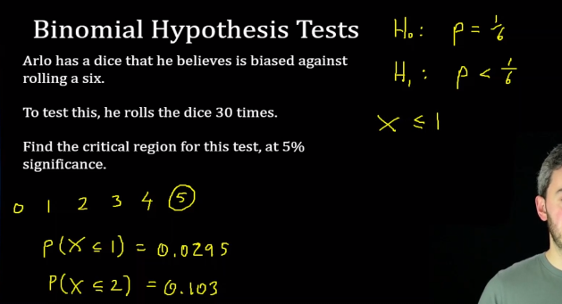

# Hypothesis Tests

## 1. What is Hypothesis Tests?

**Hypothesis Testing** is a type of statistical analysis in which you put your assumptions about a population parameter to the test. It is used to estimate the relationship between 2 statistical variables.

**P-Value**

:max_bytes(150000):strip_icc():format(webp)/Term-Definitions_p-value-fb1299e998e4477694f6623551d4cfc7.png)

In statistics, the **p-value** is the probability of obtaining results at least as extreme as the observed results of a statistical hypothesis test, assuming that the **null hypothesis** is correct.

The **p-value** approach to hypothesis testing uses the calculated probability to determine whether there is evidence to reject the **null hypothesis**:

- ***The null hypothesis***, also known as the conjecture, is the initial claim about a population (or data-generating process)
- ***The alternative hypothesis*** states whether the population parameter differs from the value of the population parameter stated in the conjecture.

## 2. Binominal Hypothesis Tests

**Critical Regions**

**X <= Number**

***Excel***

**X >= Number**

***Excel***

**Two-tailed Tests**

## 3. Poisson Hypothesis Tests

## 4. Normal Hypothesis Tests

**Critical Regions**

## 5. T-Tests

A **t test** is a statistical test that is used to compare the means of two groups. It is often used in hypothesis testing to determine whether a process or treatment actually has an effect on the population of interest, or whether two groups are different from one another.

:max_bytes(150000):strip_icc():format(webp)/t-test_final2-d26bbb129cc441c192ccf8e784ae06a4.png)

A **t test** can only be used when comparing the means of two groups (a.k.a. pairwise comparison)

When choosing a **t test**, you will need to consider two things: whether the groups being compared come from a single population or two different populations, and whether you want to test the difference in a specific direction.

## 6. Confidence Intervals

The **confidence interval** is the range of values that you expect your estimate to fall between a certain percentage of the time if you run your experiment again or re-sample the population in the same way.

:max_bytes(150000):strip_icc():format(webp)/Confidence-Interval-088dc77f639a4f71a9f00297d0db5a10.jpg)

**Confidence**, in statistics, is another way to describe probability. For example, if you construct a **confidence interval** with a 95% **confidence level**, you are confident that 95 out of 100 times the estimate will fall between the upper and lower values specified by the confidence interval.

**Example Formula**:

