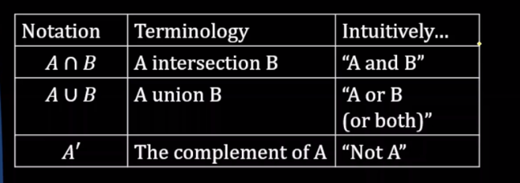

# PROBABILITY
## 1. What is probability?
**Probability** denotes the possibility of the outcome of any random event. The meaning of this term is to check the extent to which any event is likely to happen.
The** probability** is the measure of the likelihood of an event to happen. It measures the certainty of the event.

## 2. Set notation

**Examples**:

**The empty set:**

## 3. Events
### 3.1. Independent Events

### 3.2. Mutually Exclusive Events

### 3.3. Independent Events vs Mutually Exclusive Events

## 4. Conditional Probability

**Conditional probability** is defined as the likelihood of an event or outcome occurring, based on the occurrence of a previous event or outcome.

**Conditional probability** is calculated by multiplying the probability of the preceding event by the updated probability of the succeeding, or conditional, event.

## 5. Bayes' Theorem

